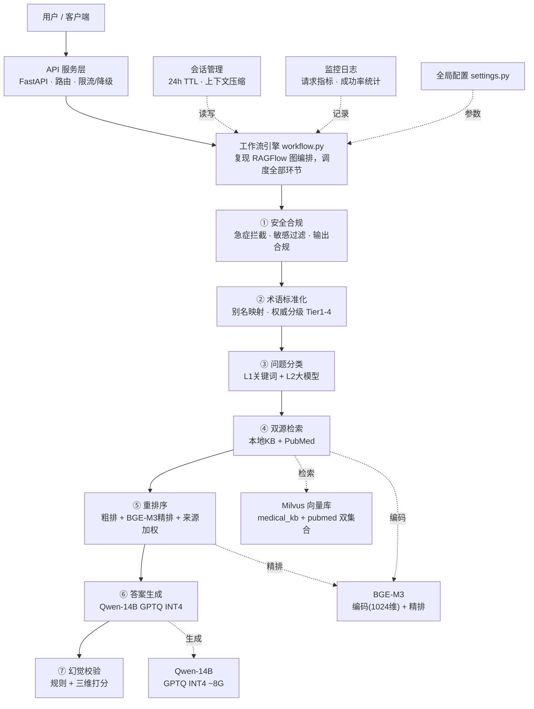

# Medical-RAG：全科医疗问诊智能助手

将 RAG 检索准确率提升 **27%**（61.8% → 78.5%）、幻觉率从 **18% 压至 3%** 的私有化医疗问诊系统。全链路本地部署，医疗数据不出域，无公网 API 调用。

[](https://github.com/yyyyyyyysf/medical-rag-agent/actions/workflows/ci.yml)
[](https://www.python.org/)
[](https://fastapi.tiangolo.com/)
[](https://milvus.io/)
[](LICENSE)

## 为什么值得看

| 亮点 | 具体实现 | 效果 |
|------|---------|------|
| 🛡️ **LLM-Judge 双层幻觉防控** | 规则硬拦截 + 模型三维打分（>6 分通过） | 幻觉率 18% → **3%** |
| 🔀 **双源检索 + 场景化路由** | 常见病→本地指南，前沿→PubMed 文献 | 检索准确率 +**27%** |
| 🧠 **14B 模型量化落地** | GPTQ INT4（28G→8G），单卡 12G 可跑 | 平均响应 **1.2s** |
| 🧪 **可复现评测体系** | MedQA 2134 条 A/B + 消融框架 | 指标可溯源、可复现 |

> 技术栈：`Python` `FastAPI` `RAGFlow` `Qwen-14B` `BGE-M3` `Milvus` `Docker`

## 系统架构



## 效果演示

接口响应结构（`/api/v1/chat`），输出自带**来源溯源**与**Judge 校验打分**：

```json
{
  "answer": "……【来源：中国XX诊治指南 Tier1】",
  "sources": [
    {"title": "中国XX诊治指南", "source": "local_kb", "score": 0.87, "department": "心内科"}
  ],
  "judge_result": {
    "layer": "both",
    "scores": {"fact_consistency": 9, "logic": 8, "usefulness": 9}
  },
  "latency_ms": 1180,
  "session_id": "550e8400-e29b-41d4-a716-446655440000"
}
```

## 快速开始

### 环境要求

- Python 3.10+
- NVIDIA GPU（推荐 RTX 3060 12G 或以上）
- Docker & Docker Compose
- Milvus 2.4+

### 安装

```bash
# 0. 克隆仓库
git clone https://github.com/yyyyyyyysf/medical-rag-agent.git
cd medical-rag-agent

# 1. 安装依赖
pip install -r requirements.txt

# 2. 配置环境变量
cp .env.example .env
# 编辑 .env 填入模型路径

# 3. 启动 Milvus
docker compose up -d

# 4. 初始化向量库
python scripts/setup_milvus.py

# 5. 导入知识库
python scripts/ingest_kb.py
python scripts/ingest_pubmed.py --download --max-results 5000

# 6. 启动服务
python -m src.main
```

### API 使用

```bash
# 单次问诊
curl -X POST http://localhost:8000/api/v1/chat \
  -H "Content-Type: application/json" \
  -d '{"query": "我最近经常头痛，是什么问题？"}'

# 多轮对话（带 session_id）
curl -X POST http://localhost:8000/api/v1/chat \
  -H "Content-Type: application/json" \
  -d '{"query": "那需要注意什么？", "session_id": "上次返回的 session_id"}'

# 查看运行统计
curl http://localhost:8000/api/v1/stats
```

### 运行测试

```bash
pytest tests/ -v
```

## 评测与消融实验

**评测口径**：公开 MedQA 中文医学问答测试集（2134 条），top1 命中判定；baseline（LlamaIndex 固定 512 分块 + 单源检索）与优化方案**同脚本、同机器**对比，保证公平性。

**消融框架**（`scripts/ablation.py`）：每个优化模块独立开关，验证贡献归因：

| 模块 | 关闭方式 | 验证问题 |
|------|---------|---------|
| LLM-Judge 幻觉校验 | `--disable judge` | 校验层对幻觉率/准确率的影响 |
| BGE-M3 两阶段重排序 | `--disable reranker` | 重排序对检索精度的贡献 |
| 场景化来源权重 | `--disable source_weight` | 双库加权 vs 等权拼接 |
| 医疗定制分块 | `--disable custom_chunk` | 定制分块 vs 通用 512 分块 |

```bash
python scripts/ablation.py                          # 完整配置
python scripts/ablation.py --disable judge          # 关掉幻觉校验
python scripts/ablation.py --disable judge reranker # 关掉多个模块
python scripts/ablation.py --samples 50             # 只跑前50条快速验证
```

> `data/medqa_test.json` 内置 **30 条可溯源样例**（答案均可在 `data/samples/` 知识库中找到），
> 用于快速验证评测管线（`--samples 5`）；完整 2134 条替换该文件即可复现全量指标。
> 注：custom_chunk 发生在数据摄入阶段，关闭它需用通用分块参数重新建库后评测。

## 工作流

```
用户提问 → 问题分类(关键词+LLM) → 并行检索(本地KB+PubMed)
        → BGE-M3 重排序(粗排+精排+来源权重)
        → LLM 生成(Qwen/DeepSeek) → 规则校验+LLM-Judge打分
        → 通过则返回 / 不通过则重试(max 2次) / 工具失败则降级
```

完整流程复现 RAGFlow 图编排（`src/core/workflow.py`），支持校验失败重试、关键词扩展重检索、工具降级与诚实拒答。

## 医疗合规设计

医疗场景风险等级高，系统内置 4 层安全防线：

1. **输入侧**：敏感词过滤 + 10 类急症检测（胸痛/大出血/意识障碍等），命中强制引导 120
2. **输出侧**：拦截确定性诊断、处方推荐、剂量指导，替换为标准化拒答话术
3. **内容侧**：知识来源权威分级（Tier1 指南 / Tier2 说明书 / Tier3 教材 / Tier4 科普），低等级来源用保守话术
4. **声明侧**：所有 API 响应头携带医学免责声明，仅提供科普参考

> 核心实现：`src/core/safety.py`（急症检测/敏感过滤/输出合规）、`src/core/knowledge_grader.py`（权威分级/术语标准化）

## 技术决策

为什么不用 LangChain 直接搭、重排为什么分两阶段、量化为什么选 GPTQ？→ 见 [docs/tech-decisions.md](docs/tech-decisions.md)

## 项目结构

<details>
<summary>点击展开目录结构</summary>

```
├── config/                  # 全局配置
│   └── settings.py          # 模型路径、向量库连接、阈值参数
├── src/
│   ├── main.py              # FastAPI 应用入口
│   ├── api/                 # API 路由 + 请求/响应模型
│   ├── core/                # 核心业务逻辑
│   │   ├── workflow.py      # 主工作流编排（RAGFlow DAG 复现）
│   │   ├── classifier.py    # 两级问题分类
│   │   ├── retriever.py     # Milvus 双源并行检索
│   │   ├── reranker.py      # BGE-M3 两阶段重排序 + 来源权重
│   │   ├── generator.py     # 答案生成（CPU/GPU 自适应）
│   │   ├── model_loader.py  # GPTQ INT4 量化模型加载
│   │   └── judge.py         # LLM-Judge 双层幻觉校验
│   ├── chunking/            # 医疗 Q&A 自定义分块
│   ├── session/             # 会话缓存 + 动态上下文压缩
│   ├── monitoring/          # 请求日志 + 运行指标
│   └── utils/               # 工具函数
├── scripts/                 # 数据生成 + 评估脚本
├── ragflow_plugins/         # RAGFlow 可插拔分块插件
├── prompts/                 # Prompt 模板
├── data/                    # 关键词库 + 样本数据 + 评测集
├── tests/                   # 单元测试 + API 测试
├── docs/                    # 技术决策文档
├── docker-compose.yml       # 容器编排
└── requirements.txt
```

</details>

## 免责声明

本产品仅提供医学科普参考，不构成任何诊疗建议。身体不适请及时前往正规医疗机构就诊。
