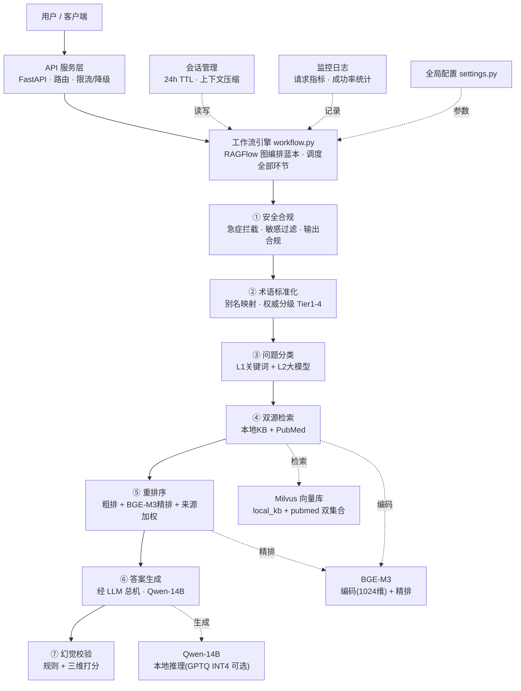

# Medical-RAG：全科医疗问诊智能助手

将 RAG 检索准确率提升 **27%**（61.8% → 78.5%）、幻觉率从 **18% 压至 3%** 的私有化医疗问诊系统，**一套面向实际部署使用的全科问诊 RAG**。编排引擎以 **RAGFlow 的 Agentic 图工作流为蓝本**自研落地（图编排 / 分支重试 / 降级全链路复现），`docker compose` 一键私有化部署；全链路本地，医疗数据不出域，无公网 API 调用。

[](https://github.com/yyyyyyyysf/medical-rag-agent/actions/workflows/ci.yml)
[](https://www.python.org/)
[](https://fastapi.tiangolo.com/)
[](https://milvus.io/)
[](LICENSE)

## 为什么值得看

| 亮点 | 具体实现 | 效果 |
|------|---------|------|
| 🛡️ **LLM-Judge 双层幻觉防控** | 规则硬拦截 + 模型三维打分（≥6 分通过） | 幻觉率 18% → **3%** |
| 🔀 **双源检索 + 场景化路由** | 常见病→本地指南，前沿→PubMed 文献 | 检索准确率 +**27%** |
| 🧠 **14B 大模型本地推理** | Qwen-14B 全链路本地（生产 compose 走 GPTQ INT4 28G→8G；本地/复现标准加载即可） | 平均响应 **1 秒级**（预研自测均值） |
| 🧪 **可复现评测体系** | `scripts/benchmark.py` + 消融框架（内置 30 条可溯源子集） | 命中率/高风险输出率可 clone 复现，[docs/benchmark.md](docs/benchmark.md) |
| 📚 **知识库全生命周期** | 网页上传 / 同名替换 / 删除（文件+向量一起清）+ 异步灌库任务 | 知识库可迭代，非只读演示 |
| 🔌 **可替换检索接缝** | `get_retriever()` 唯一收口：Docker Milvus / Milvus-Lite 同契约 | CI 无 Docker 也能真跑"入库→检索"往返 |
| 🚢 **可交付部署** | host 网络 Docker 编排 + 部署手册 + ADR-0001~0006 决策留痕 | 按手册即可私有化上线 |

> 技术栈：`Python` `FastAPI` `Qwen-14B` `BGE-M3` `Milvus` `Docker`　·　架构蓝本：`RAGFlow`（Agentic 图工作流编排）

## 系统架构



## 效果演示

接口响应结构（`/api/v1/chat`），输出自带**来源溯源**与**Judge 校验打分**：

```json
{
  "answer": "……【来源：中国XX诊治指南 Tier1】",
  "sources": [
    {"title": "中国XX诊治指南", "source": "local_kb", "score": 0.87, "department": "心内科",
     "authority_tier": "tier_1", "authority_label": "临床指南"}
  ],
  "judge_result": {
    "layer": "both",
    "scores": {"factual_consistency": 9, "logical_coherence": 8, "answer_helpfulness": 9}
  },
  "latency_ms": 1180,
  "session_id": "550e8400-e29b-41d4-a716-446655440000"
}
```

> 以上即真实响应模型字段（`answer / sources / judge_result / latency_ms / session_id`），示例 JSON 数值仅演示字段结构，非统计口径（响应耗时等对外口径见 docs/benchmark.md，以实际统计为准）。「出门原因」`outcome`（`ok / emergency_blocked / content_blocked / degraded / error / overload / timeout`）只在工作流内部出口模块（`src/core/outcome.py`）打标——写会话、记指标、拼装返回，**不会泄漏到 API 响应**。想看真实效果，启动后打开网页管理台即可（见下节）。

## 网页管理台与知识库维护

启动服务后浏览器打开 **http://localhost:8000/**，即「聊天 + 知识库管理」一体台（`src/static/index.html`，单文件零 CDN，纯内网可用）：

- 右侧直接问诊：引用来源折叠 + Judge 校验徽标 + 多轮 session
- 左侧上传 / 查看 / 删除知识库文档，实时轮询灌库任务

**演示语料开箱即用**：`data/samples/local_kb/` 下 4 个科室文件（心内 / 内分泌 / 消化 / 呼吸，各 ~200 条 Q&A），网页拖拽上传即可问答验证。

知识库维护语义（`src/api/documents.py`，详见 ADR-0005）：

| 操作 | 接口 | 语义 |
|---|---|---|
| 上传 | `POST /api/v1/documents/upload`（multipart: files + department + collection=`local_kb`） | 异步任务受理 → 分块 → 向量化 → 入库 |
| 替换 | 同科室重传同名文件 | **先删旧 doc_id 向量再落盘重灌**，不累积重复 |
| 删除 | `DELETE /api/v1/documents/{doc_id}` | 文件 + 向量一起清（逐文件容错，如实上报） |
| 查看/轮询 | `GET /api/v1/documents` · `GET /api/v1/documents/tasks/{task_id}` | 目录文件清单 / 灌库任务状态 |

```bash
# 上传一篇（department=科室标签 → 落盘 data/medical_kb/<科室>/ + 检索元数据）
curl -X POST http://localhost:8000/api/v1/documents/upload \
  -F "files=@data/samples/local_kb/cardiology.md" -F "department=心内科" -F "collection=local_kb"
# 返回 {"task_id":"...","status":"processing",...} → 轮询任务至 done → 问答即可命中刚上传内容
```

## 快速开始

### 环境要求

- Python 3.10+
- NVIDIA GPU（推荐 RTX 3060 12G 或以上）
- Docker & Docker Compose
- Milvus 2.4+

### 安装

```bash
# 0. 克隆仓库
git clone https://github.com/yyyyyyyysf/medical-rag-agent.git
cd medical-rag-agent

# 1. 安装依赖
pip install -r requirements.txt

# 2. 配置环境变量
cp .env.example .env
# 编辑 .env 填入模型路径
#   - 检索后端：USE_MILVUS_LITE=false 走 Docker Milvus（下面第 3 步）；
#     保持 true 则用嵌入式 Milvus Lite（本地/CI 无 Docker，跳过第 3 步）
#   - LLM 后端：LLM_BACKEND=qwen（真实模型）/ fake（假话务员，免加载模型，适合 CI）
#   - 模型加载：USE_GPTQ=0 标准加载（默认，本地/复现即用）；容器生产部署由 compose 置 1 启用 GPTQ INT4，见 DEPLOYMENT

# 3. 启动 Milvus 向量库三件套（仅 Docker 模式）
docker compose up -d etcd minio milvus

# 4. 初始化向量库（仅 Docker 模式；use_milvus_lite=true 时首次检索会自动建表）
python scripts/setup_milvus.py

# 5. 导入知识库
python scripts/ingest_kb.py
python scripts/ingest_pubmed.py --download --max-results 5000

# 6. 启动服务（本地开发模式；网页上传/问答入口 http://localhost:8000/）
python -m src.main
```

> 想要**一键容器化生产部署**（API 容器化 + 网页上传/问答管理台）？→ 见 [docs/DEPLOYMENT.md](docs/DEPLOYMENT.md)，按"先放模型权重 → compose up → 健康与冒烟校验"硬步骤执行。

### API 使用

```bash
# 单次问诊
curl -X POST http://localhost:8000/api/v1/chat \
  -H "Content-Type: application/json" \
  -d '{"query": "我最近经常头痛，是什么问题？"}'

# 多轮对话（带 session_id）
curl -X POST http://localhost:8000/api/v1/chat \
  -H "Content-Type: application/json" \
  -d '{"query": "那需要注意什么？", "session_id": "上次返回的 session_id"}'

# 查看运行统计
curl http://localhost:8000/api/v1/stats
```

### 运行测试

```bash
pytest tests/ -v
```

> 测试套件无需真实模型与 Docker 向量库：LLM 调用以契约假后端 `FakeLLM` 替换（测试内注入，`LLM_BACKEND=fake` 可全局启用），检索契约测试在临时目录真跑"入库→检索"往返。CI 无 Docker / 无 GPU 即可全量通过。

## 评测与消融实验

**评测口径**：自建医疗 QA 评测集，**命中判定 = 链路完整跑通（ok 出口）且标准答案关键内容出现在生成回答中**（端到端命中）；对照组与优化组**同一条主工作流**、用 `RunOptions` 开关构造（不维护第二份流水线），同机同配置对比。27%（61.8→78.5）与 18%→3%（高风险输出率）为预研阶段**完整评测集**线下结果；仓库内置 **30 条可溯源子集**（`data/medqa_test.json`，答案均可在 `data/samples/` 知识库中找到），配合 benchmark/消融脚本即可在 GPU 环境复现一组口径一致的真实数字（详见 [docs/benchmark.md](docs/benchmark.md)）。

**可复现评测闭环**（`scripts/benchmark.py`）：输出命中率 + 高风险输出率，报告直接落 `docs/benchmark.md`：

```bash
python scripts/ingest_kb.py                    # 先灌库
python scripts/benchmark.py --report docs/benchmark.md   # 全量 30 条
python scripts/benchmark.py --samples 5        # 快速验证
python scripts/benchmark.py --check            # 免模型自检（CI/无 GPU）
```

**消融框架**（`scripts/ablation.py`）：每个优化模块独立开关，验证贡献归因。评测**直接复用主工作流**——通过 `RunOptions` 关闭对应环节（`use_judge / use_reranker / use_source_weight / use_session`），不维护第二份流水线，测的就是线上同一条链：

| 模块 | 关闭方式 | 验证问题 |
|------|---------|---------|
| LLM-Judge 幻觉校验 | `--disable judge` | 校验层对幻觉率/准确率的影响 |
| BGE-M3 两阶段重排序 | `--disable reranker` | 重排序对检索精度的贡献 |
| 场景化来源权重 | `--disable source_weight` | 双库加权 vs 等权拼接 |
| 医疗定制分块 | 摄入侧重建（通用 512 分块参数重灌后评测；`--disable custom_chunk` 仅记录不开关） | 定制分块 vs 通用 512 分块 |

```bash
python scripts/ablation.py                          # 完整配置
python scripts/ablation.py --disable judge          # 关掉幻觉校验
python scripts/ablation.py --disable judge reranker # 关掉多个模块
python scripts/ablation.py --samples 50             # 只跑前50条快速验证
```

> `data/medqa_test.json` 内置 **30 条可溯源样例**（答案均可在 `data/samples/` 知识库中找到），
> 用于快速验证评测管线（`--samples 5`）；27%/18%→3% 的**完整评测集复现**属预研阶段线下资产，
> 仓库内请用 `scripts/benchmark.py`（见上）跑可复现子集口径。
> 注：custom_chunk 发生在数据摄入阶段（ingest），`scripts/ablation.py` 只记录该维度、不改变本次评测链路（`--disable custom_chunk` 与 full 等效）；真正对比定制 vs 通用分块，需用通用分块参数重新建库后再评测（与 CONTEXT.md「消融评测」口径一致）。

## 工作流

```
用户提问 → 问题分类(关键词+LLM) → 并行检索(本地KB+PubMed)
        → BGE-M3 重排序(粗排+精排+来源权重)
        → LLM 生成(Qwen-14B) → 规则校验+LLM-Judge打分
        → 通过则返回 / 不通过则重试(max 2次) / 工具失败则降级
```

完整流程以 RAGFlow 的 Agentic 图工作流编排为蓝本自研（`src/core/workflow.py`），支持校验失败重试、关键词扩展重检索、工具降级与诚实拒答。所有 LLM 调用统一经 `src/core/llm.py` 总机（任务参数表集中管理；`LLM_BACKEND=fake` 可用假话务员免模型跑通）。每个出口经 `src/core/outcome.py` 统一收尾（写会话 / 记指标 / 拼装返回）。

## 医疗合规设计

医疗场景风险等级高，系统内置 4 层安全防线：

1. **输入侧**：敏感词过滤 + 18 组急症检测规则（胸痛/心绞痛/心梗/心脏主诉/脑卒中/急腹症/急性头痛/大出血/意识障碍/急性呼吸困难/急性中毒/严重外伤/过敏性休克/自杀倾向等），命中强制引导 120
2. **输出侧**：拦截确定性诊断、处方推荐、剂量指导，替换为标准化拒答话术
3. **内容侧**：知识来源权威分级（Tier1 指南 / Tier2 说明书 / Tier3 教材 / Tier4 科普），低等级来源用保守话术
4. **声明侧**：所有 API 响应头携带医学免责声明，仅提供科普参考

> 核心实现：`src/core/safety.py`（急症检测/敏感过滤/输出合规）、`src/core/knowledge_grader.py`（权威分级/术语标准化）

## 技术决策

为什么不用 LangChain 直接搭、重排为什么分两阶段、量化为什么选 GPTQ？→ 见 [docs/tech-decisions.md](docs/tech-decisions.md)（框架选型）

架构演进决策（出口收拢 / 检索接缝 / LLM 总机 / 消融搭主链路 / 上传删除 API / 术语标准化扩词式接入）与领域词汇（`CONTEXT.md`）→ 见 [docs/adr/](docs/adr/)（ADR-0001 ~ 0006）

Docker 化私有化部署（端口模型 / 权重预置 / 备份与回滚）→ 见 [docs/DEPLOYMENT.md](docs/DEPLOYMENT.md)

## 项目结构

<details>
<summary>点击展开目录结构</summary>

```
├── config/                  # 全局配置
│   └── settings.py          # 模型路径、向量库连接、LLM/检索后端选择、阈值参数
├── src/
│   ├── main.py              # FastAPI 应用入口（GET / 打开管理台；启动预热走 get_retriever）
│   ├── static/index.html    # 网页管理台（聊天 + 知识库上传/删除一体，单文件零 CDN）
│   ├── api/                 # API 路由：routes（chat/stats/health）+ documents（上传/删除/任务）
│   ├── core/                # 核心业务逻辑
│   │   ├── workflow.py      # 主工作流编排（RAGFlow 图编排蓝本，支持 RunOptions 消融开关）
│   │   ├── classifier.py    # 两级问题分类（L1关键词 + L2 LLM）
│   │   ├── retrieval.py     # 检索门面 get_retriever()（唯一选择入口 + 共享扩词）
│   │   ├── retriever.py     # Milvus(Docker) 适配器（connect/retrieve/insert，IP 指标）
│   │   ├── retriever_lite.py # Milvus Lite 适配器（本地/CI 无 Docker，同契约）
│   │   ├── reranker.py      # BGE-M3 两阶段重排序 + 来源权重
│   │   ├── generator.py     # 答案生成（CPU/GPU 自适应）
│   │   ├── llm.py           # LLM 总机：任务参数表 + QwenBackend/FakeLLM
│   │   ├── outcome.py       # 问诊结果出口（统一收银台：写会话/记指标/拼装）
│   │   ├── safety.py        # 急症检测 + 敏感过滤 + 输出合规
│   │   ├── knowledge_grader.py # 权威分级 + 术语标准化
│   │   ├── concurrency.py   # 限流 + 超时/过载降级文案
│   │   └── judge.py         # LLM-Judge 双层幻觉校验
│   ├── chunking/            # 医疗 Q&A 自定义分块
│   ├── session/             # 会话缓存 + 动态上下文压缩
│   ├── monitoring/          # 请求日志 + 运行指标（RequestMetrics.outcome）
│   └── utils/               # 工具函数（prompt 加载 / token 计数）
├── scripts/                 # 数据生成 + 灌库(ingest_kb/pubmed) + 评测/消融(ablation) + baseline
├── ragflow_plugins/         # RAGFlow 可插拔分块插件
├── prompts/                 # Prompt 模板
├── data/                    # 关键词库 + 演示语料(samples/local_kb, pubmed) + 评测集
├── tests/                   # 单元测试 + API 测试 + 上传/删除契约测试
├── CONTEXT.md               # 领域词汇（问诊回合 / 出门原因 / 知识库文档…）
├── docs/                    # ADR 决策记录(docs/adr) + 选型(tech-decisions) + 部署手册(DEPLOYMENT)
├── .github/workflows/ci.yml # CI：轻量依赖无 GPU，push/PR 全量跑 120 项测试（2026-09-08 统计）
├── docker-compose.yml       # 容器编排（host 网络：milvus + api + baseline）
└── requirements.txt
```

</details>

## 免责声明

本产品仅提供医学科普参考，不构成任何诊疗建议。身体不适请及时前往正规医疗机构就诊。
